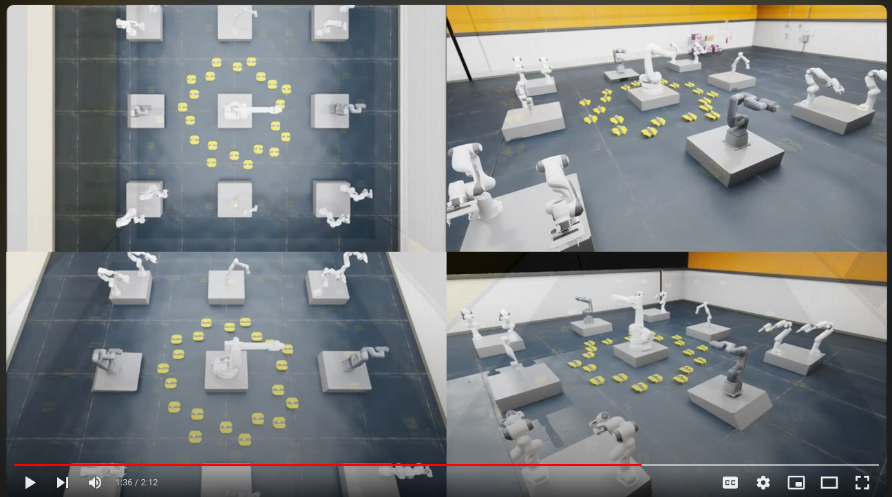
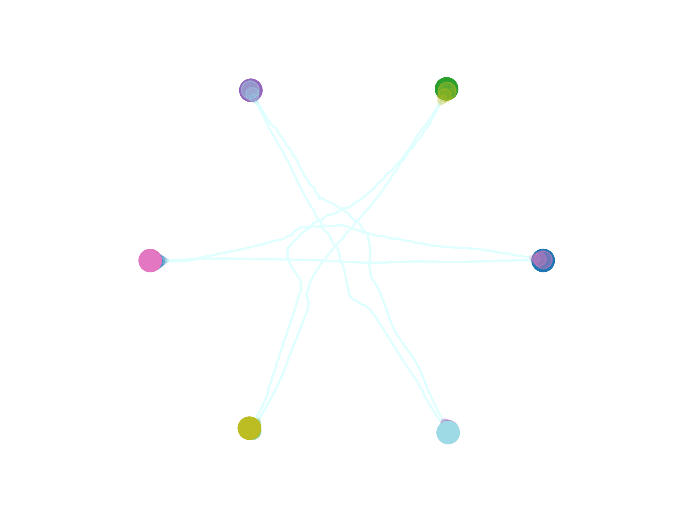
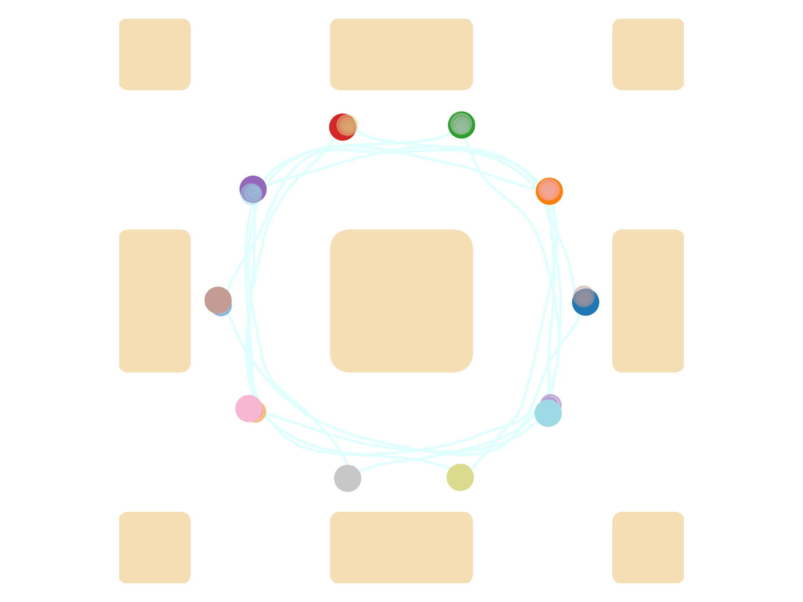
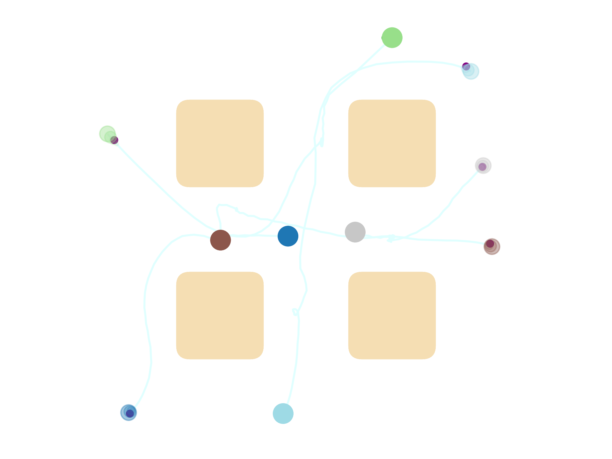

# Multi-Robot Motion Planning with Diffusion Models

Welcome to our repository implementing MMD, as presented in:

<table style="border: none;">
<tr>
<td style="vertical-align: middle; border: none;">
  <a href="https://arxiv.org/abs/2410.03072">
    
  </a>
</td>
<td style="vertical-align: middle; border: none;">
  <i>Shaoul*, Y., Mishani*, I., Vats*, S., Li, J. and Likhachev, M., 2024. <strong>Multi-Robot Motion Planning with Diffusion Models</strong>. arXiv preprint arXiv:2410.03072.</i>
</td>
</tr>
</table>

[](https://www.youtube.com/watch?v=lyW2IL_tJt0&ab_channel=yoraish)

---
This repository includes code for `MMD`, a method for multi-robot motion planning using diffusion models.

**Updates**
- [2024-11-07] We have cleaned up the code and released it on Github. The release includes stylistic and efficiency modifications to the code which may lead to slightly different results than those reported in the paper.


---
## Installation
We have tested run our code on Ubuntu 20.04. The code _should_ work on other platforms, but we have not tested it.

### Requirements
- [miniconda](https://docs.conda.io/projects/miniconda/en/latest/index.html)

### Installation Steps
1. Clone this repository and change directory into it:
    ```bash
    cd ~
    git clone https://github.com/yoraish/mmd.git
    cd mmd
    ```
2. Create a conda environment and activate it:
    ```bash
    conda env create -f environment.yml
    conda activate mmd
    ```
3. Install PyTorch. This may be different depending on your system. We used the following command:
    ```bash
   conda install pytorch==2.0.0 torchvision==0.15.0 torchaudio==2.0.0 pytorch-cuda=11.8 -c pytorch -c nvidia
    ```
4. Install the local packages. Those are mostly the work of [An Thei Le](https://github.com/anindex) and [João Carvalho](https://github.com/jacarvalho). Thank you for sharing your code!
    ```bash
   cd deps/torch_robotics
   pip install -e .
   cd ../experiment_launcher
   pip install -e .
   cd ../motion_planning_baselines
   pip install -e .
   cd ../..
   ```
5. Install the `mmd` package:
    ```bash
    pip install -e .
    ```
6. Run the bash setup script to install `gdown`.  
    ```
    bash setup.sh
    ```

---
## Planning with MMD
`mmd` produces data-driven multi-robot trajectories in a single map or in a collection of "tiled" local maps. Let's take a look at how to use it.
### Obtaining Sample Datasets and Models
To make it easy to run `mmd`, we provide sample datasets and a few pre-trained models. We also provide scripts for generating data (slightly modified scripts from [MPD](https://github.com/jacarvalho/mpd-public)). You can download the sample datasets and models with the following commands:

Note: The `data_trained_models` may be prohibitively large for some, so we also provide a smaller version named `data_trained_models_small`.

```bash
conda activate mmd
```

```bash
gdown --id 1Onw0s1pDsMLDfJVOAqmNme4eVVoAkkjz
tar -xJvf data_trajectories.tar.xz

gdown --id 1WO3tpvg-HU0m9RyDvGyfDamo7roBYMud
tar -xJvf data_trained_models.tar.xz
```

Smaller file:
```bash
gdown --id 1idBod6n8u38skqMwe4PEeAUFR1TiMC8h
tar -xJvf data_trained_models_small.tar.xz
# Rename.
mv data_trained_models_small data_trained_models
```

### Running Inference
Let's look at a few ways to run inference with `mmd`.  

#### Inference Script
The simplest way to run `mmd` is via the `inference_multi_agent.py` script, as show below:

```bash
cd scripts/inference
python3 inference_multi_agent.py
```

This script would plan for a team of robots and save a GIF of the result. Modify the `global_model_ids` variable in the script to choose a different model/map. Some results will look like this:

|       |        |
|:---------------------------------------:|:---------------------------------------------:|
|                Empty Map                |                 Conveyor Map                  |
|  |  |
|              Highways Map               |                Drop-Region Map                |


Switching the `example_type` variable from `"single_tile"` to `"multi_tile"` will run a multi-tile example, where the tiled map is a 1x2 grid where each cell is an empty map.

[//]: # ()


The results will be saved under the `mmd/results/` directory.

**A Note on Inference**
In this work, we primarily use the single-robot planner class named `MPDComposite`. This class allows composing multiple single-robot diffusion models and planning long-horizon trajectories through a sequence of local maps/skills. We also provide a single-robot planner named `MPD` which is unable to compose models, but could be simpler to understand (it is a "constrainable" version of [MPD](https://github.com/jacarvalho/mpd-public)). We do not guarantee identical behaviors between the two files, but encourage users trying to understand the code to look at `MPD` first. You can use `MPD` as the single-robot planner by changing the `single_agent_planner_class` variable in the inference script. 


---

## Generating a Dataset
### General Datasets
To generate a dataset of trajectories, do the following:
```bash 
conda activate mmd
cd scripts/generate_data
python3 launch_generate_trajectories.py
```
You can choose different maps by modifying the script in `launch_generate_trajectories.py`. In each map, a "skill" motion is specified. The data generation script connects a start position to the beginning of the skill, and its end to the goal position.
The generated data will be saved in the `logs/` directory. In order to use the generated data, please move it to the `~/mmd/data_trajectories/` directory.

### Linear Motion Datasets
Sometimes we are also interested in generating simpler linear motions from start to goal. To do that, please modify the `launch_generate_trajectories.py` script to only produce one trajectory per start/goal pair (`num_trajectories_per_context = 1`), and modify the 
`generate_trajectories.py` script by commenting out the block around line 770 calling `generate_collision_free_trajectories` and uncomment the one below it calling `generate_linear_trajectories`. This is a bit hacky. Sorry :).

## Training Single-Robot Diffusion Models
```bash
cd scripts/train_diffusion
python3 launch_train_01.py
```

## Running Experiment Sets
We provide code for creating experiment sets combining different models, robot numbers, and  multi-robot planning algorithms. To run an example experiment set, do the following:
```bash
conda activate mmd
cd scripts/inference
python3 launch_multi_agent_experiment.py
```

---
## Citation

If you use our work or code in your research, please cite our paper:
```latex
@article{shaoul2024multi,
  title={Multi-Robot Motion Planning with Diffusion Models},
  author={Shaoul, Yorai and Mishani, Itamar and Vats, Shivam and Li, Jiaoyang and Likhachev, Maxim},
  journal={arXiv preprint arXiv:2410.03072},
  year={2024}
}
```

---
## Credits

Parts of this work and software were taken and/or inspired from:
- Major sections (including Torch Robotics, Experiment Launcher, and Motion Planning Baselines) were taken from [https://github.com/jacarvalho/mpd-public](https://github.com/jacarvalho/mpd-public). We appreciate the authors for sharing their code and for making it easy to use! The original license is included in the repository `LICENSE` file.
- [https://github.com/jannerm/diffuser](https://github.com/jannerm/diffuser)

---
## A Few Notes 
* Parts of the code assume a 2D Disk robot with a state vector [x, y, vx, vy]: positions ([x,y]) stacked on velocities ([vx, vy]). This means that using this code for general robots, with different state vectors, may require some modifications. In particular the files `diffusion_ensemble.py` and `mpd_ensemble.py` may need to be modified.